  

  
  
  
  

  
  

## `> whoami`

I build machine learning systems and the measurement that tells you whether to trust them.

- **Now:** AI Image Engineer at the University of Missouri's Precision and Automated Agriculture Lab, where I own the training pipeline, the evaluation framework and the data quality tooling.
- **Studying:** M.S. in Computer and Information Sciences at the University of Missouri (graduating May 2027).
- **Before:** Software Engineer at MAQ Software, a Microsoft partner, delivering data platforms for Fortune 500 clients.
- **Outside coursework:** LLM agent tooling, built in public, with tests and CI.

## `> ls ./featured`

| Project | What it does | Stack |
| --- | --- | --- |
| **[HireLine](https://github.com/srikar0805/hireline)** &nbsp;[`live`](https://hireline-self.vercel.app) | Paste a job link and get the likely hiring manager and recruiter titles, the company's email format read from its own website, and a drafted note. Free, no account, no paid data. | Next.js 16, TypeScript, Vercel |
| **[career-agent](https://github.com/srikar0805/career-agent)** | A career operating system for Claude Code: 15 skills and 7 subagents that draft from an evidence bank of real work, with a fact-checker that blocks any claim it cannot trace. | Python, Claude Code, multi-agent |
| **[ReproAgent](https://github.com/srikar0805/ReproAgent)** | Reads a paper alongside its repository and returns an evidence-backed verdict on whether the result reproduces, naming the missing artifact when it cannot. | Python, LLM agents, CI |
| **[agent-tab](https://github.com/srikar0805/agent-tab)** | Daily cost accounting across Claude Code, Codex CLI and Gemini CLI, rendered above the shell prompt. No daemon, no database, no network calls. | TypeScript, CI |
| **[Mizzou Guardian AI](https://github.com/srikar0805/studentsafety-companion)** | Multi-agent RAG platform fusing 20,000+ incident records into 0-100 safety scores that show the weighted factors behind them. | FastAPI, PostgreSQL, PostGIS |
| **[GraphNet-Sentry](https://github.com/srikar0805/GraphNet-Sentry)** | Hybrid ResNet-50 and graph neural network for intrusion detection, validated on held-out datasets rather than held-out rows. | PyTorch, GNNs |

More in the [portfolio](https://srikar0805.github.io/Srikar_portfolio.github.io/#projects).

## `> cat stack.yaml`

  
  
  
  
  
  

  
  
  
  
  
  
  

  
  
  
  
  
  
  
  
  
  

## `> ls ./credentials`

| Credential | Issuer | Verify |
| --- | --- | --- |
| Microsoft Certified: Fabric Analytics Engineer Associate | Microsoft | [link](https://learn.microsoft.com/users/saikollimaqsoftware-9235/credentials/db5dde17437d00e6) |
| Road to Practitioner (invitation-only, 12 weeks, graded capstone) | IBM, via the Mizzou Quantum Innovation Center | [link](https://www.credly.com/badges/38bd81ec-e9b9-44e8-8088-163c681fbbc0) |
| Neural Networks and Deep Learning | DeepLearning.AI | [link](https://coursera.org/verify/QBY3KXIAGCRS) |
| Supervised Machine Learning: Regression and Classification | DeepLearning.AI and Stanford University | [link](https://coursera.org/verify/R03AI9RTGMYO) |

## `> git log --stats`

  

Rendered daily by <a href="./.github/workflows/stats.yml">a GitHub Action</a> in this repo from public data, so it never depends on an outside card service.
